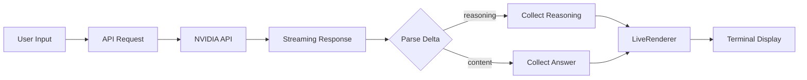
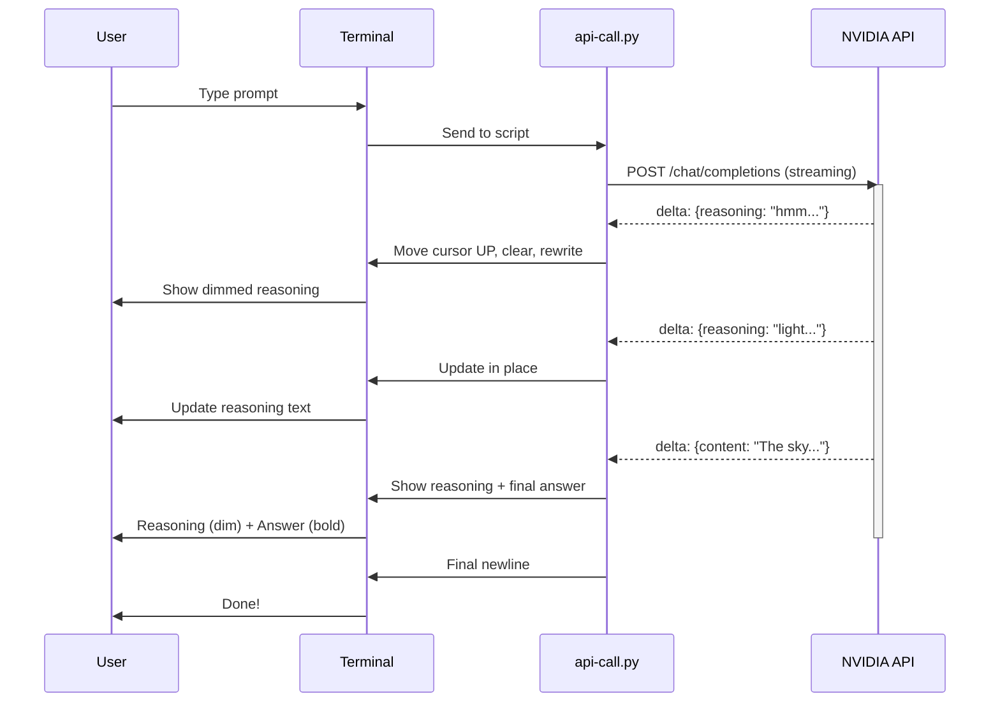

# The Story of a Chat Cursor

*A short tale about what happens behind the screen*

Every time you use an AI chatbot, there's a tiny hero working behind the scenes: **the cursor**.

You type a question. Hit enter. The cursor blinks. And then... text starts appearing. But here's what most people don't know: that text isn't written all at once. It's streamed, token by token.

The magical part? It doesn't scroll down your screen. It *updates in place*. Same line, same space, just... changing.


## Demo

```bash
# Run with streaming and reasoning enabled (default)
make run PROMPT="Why is the sky blue?"

# Or manually
uvx --with python-dotenv --with requests python api-call.py "Why is the sky blue?"
```


## The Terminal Dance

```text
┌──────────────────────────────────────────────────────┐
│  > Why is sky blue?                                  │
│                                                      │
│  REASONING:                                          │
│  Let me think about light scatterin...               │  ← cursor up, overwrite
│  FINAL ANSWER:                                       │
│  The sky appears blue because...                     │  ← cursor up, overwrite
│                                                      │
└──────────────────────────────────────────────────────┘
```

How? Terminal escape codes. Three lines of Python that make the magic happen:

```python
# From api-call.py — the cursor dance
sys.stdout.write(f"\033[{self.rendered_lines}F")  # Move cursor N lines UP
sys.stdout.write("\r")                             # Move to line start
sys.stdout.write("\033[J")                         # Clear to end of screen
```

It's like a scoreboard at a live game — same position, fresh numbers each time. The `F` (Form feed) code moves the cursor up, `\r` returns to column zero, and `\033[J` wipes everything below. Three escape codes. That's all it takes.


## Architecture




## The Three-Second Replay

Here's what's actually happening on your screen, frame by frame:

```text
╔══════════════════════════════════════════════════════╗
║  STEP 1: You hit enter                               ║
╠══════════════════════════════════════════════════════╣
║                                                      ║
║  > Why is sky blue?                                  ║
║                                                      ║
║  REASONING: Let me think...                          ║  ← first token arrives
║  FINAL ANSWER: ...                                   ║
║                                                      ║
╚══════════════════════════════════════════════════════╝

╔══════════════════════════════════════════════════════╗
║  STEP 2: Reasoning streams in                        ║
╠══════════════════════════════════════════════════════╣
║                                                      ║
║  > Why is sky blue?                                  ║
║                                                      ║
║  REASONING: Let me think about light scatterin...    ║  ← overwrites step 1
║  FINAL ANSWER: ...                                   ║
║                                                      ║
╚══════════════════════════════════════════════════════╝

╔══════════════════════════════════════════════════════╗
║  STEP 3: Final answer appears                        ║
╠══════════════════════════════════════════════════════╣
║                                                      ║
║  > Why is sky blue?                                  ║
║                                                      ║
║  REASONING: Let me think about light scatterin...    ║
║  FINAL ANSWER: The sky appears blue because of...    ║  ← answer streams in
║                                                      ║
╚══════════════════════════════════════════════════════╝
```

Same box. Same position. New content. That's the cursor doing its job.


## The Loading Spinner Analogy

Remember the old days of waiting for a webpage to load? You'd stare at a frozen screen, wondering if it was broken or just slow. Then came the spinner — and suddenly waiting felt *bearable*. Not because the page loaded faster, but because you *saw* something happening.

Reasoning tokens do the same thing.

When you watch the model "think" — those streaming thoughts appearing in real-time — you're not staring at a blank wall. You see it working. Progress. Proof of life. That's why it's called "reasoning" and not just "loading" — because seeing the work reduces anxiety, just like the spinner did for web pages.


## What Are Reasoning Tokens?

But where does the text come from?

Modern LLMs don't just "answer" — they *think*. And they do it with reasoning tokens. These are special tokens the model generates internally while processing your prompt. They're not the final answer. They're the model's scratchpad. Its working memory.

```text
┌──────────────────────────────────────────────────────┐
│  The API streams two things in sequence:            │
│                                                      │
│  Frame 1:                                           │
│  { "delta": { "reasoning": "Let me think..." } }    │  ← thinking (ephemeral)
│  { "delta": { "reasoning": "light scatter..." } }  │
│                                                      │
│  Frame 2:                                           │
│  { "delta": { "content": "The sky is blue..." } }   │  ← answering (final)
│  { "delta": { "content": " because of Rayleigh..." }}
│                                                      │
│  Final stored response:                             │
│  { "reasoning": "...", "content": "The sky..." }   │  ← only content saved
└──────────────────────────────────────────────────────┘
```

From the actual code in `api-call.py`:

```python
delta = chunk["choices"][0].get("delta", {})
if delta.get("reasoning"):
    reasoning.append(delta["reasoning"])      # collected separately
if delta.get("content"):
    content.append(delta["content"])         # collected separately
renderer.render("".join(reasoning), "".join(content))
```

The renderer gets both, splits them into two buckets, and displays them in two different visual styles.


## How Does It Output Both Without Mixing?

Here's the clever bit.

When you enable thinking, the model generates reasoning tokens **first**, then content tokens. They're separate channels — like two radio frequencies broadcast together, then tuned into separately:

```text
┌───────────────────────────────────────────────────────┐
│                   THE MODEL                          │
│                                                       │
│  ┌─────────────────────────────────────────────┐    │
│  │  CHANNEL 1 (reasoning)  — generated first   │    │
│  │  "hmm..." → "light" → "scattering..."      │    │
│  └─────────────────────────────────────────────┘    │
│                         ↓                            │
│  ┌─────────────────────────────────────────────┐    │
│  │  CHANNEL 2 (content)   — generated second   │    │
│  │  "The" → "sky" → "is" → "blue..."          │    │
│  └─────────────────────────────────────────────┘    │
│                         ↓                            │
│              API tag: {reasoning: "...",            │
│                          content: "..."}            │
│                         ↓                            │
│    ┌─────────────────────────────────────────┐      │
│    │ REASONING:  Let me think about light...  │      │  ← dimmed
│    │ FINAL:      The sky is blue because...   │      │  ← bold
│    └─────────────────────────────────────────┘      │
│                                                       │
│  Final stored response: content ONLY                 │
└───────────────────────────────────────────────────────┘
```

And from the renderer code — how it's styled differently:

```python
# Reasoning: dim gray
DIM = "\033[2m"
parts.append(styled("REASONING:", dim=True))
parts.append(styled(reasoning_text or "...", dim=True))

# Answer: bold white
BOLD = "\033[1m"
parts.append(styled("FINAL ANSWER:", bold=True))
parts.append(styled(content_text or "...", bold=True))
```

Two ANSI codes. Two visual styles. Same cursor, two jobs.


## Wait, Isn't That Just Chain of Thought?

You might have heard of CoT — "think step by step." That's when you *ask* the model to explain its reasoning, and it writes that explanation as part of the response. The reasoning *pollutes* your answer.

```text
┌───────────────────────────┬───────────────────────────┐
│   Chain of Thought        │   Native Reasoning       │
│   (you ask for it)        │   (built-in)             │
├───────────────────────────┼───────────────────────────┤
│                           │                           │
│  "Let me think step       │   [visible only during    │
│   by step: light..."      │    streaming, then gone]  │
│                           │                           │
│  Reasoning IS the         │   Final answer:           │
│  response. You get BOTH   │   "The sky is blue..."    │
│  thinking AND answer.     │   Clean. No thinking.     │
│                           │                           │
├───────────────────────────┼───────────────────────────┤
│  Added to token count?    │   Added to token count?    │
│  YES                      │   NO (ephemeral)          │
├───────────────────────────┼───────────────────────────┤
│  In final context?        │   In final context?       │
│  YES                      │   NO                     │
└───────────────────────────┴───────────────────────────┘
```

**The difference in one sentence:**
- **CoT**: You ask → reasoning becomes part of your response → answer is cluttered, you pay for every thinking token
- **Native reasoning tokens**: Built into the model → reasoning shown during streaming only → final answer stays clean, you don't pay for thinking


## Full Flow




## Prerequisites

- [uv](https://github.com/astral-sh/uv) installed
- NVIDIA API key (get one at [NVIDIA AI](https://build.nvidia.com/))


## Setup

1. Copy `.env.example` to `.env`:
   ```bash
   cp .env.example .env
   ```

2. Add your NVIDIA API key to `.env`:
   ```
   NVIDIA_API_KEY=nvapi-your-key-here
   ```


## Usage

### Basic Usage

```bash
make run
```

### Custom Prompt

```bash
make run PROMPT="What is Python?"
```

### Disable Reasoning

```bash
uvx --with python-dotenv --with requests python api-call.py "Hello" --no-reasoning
```

### Disable Streaming

```bash
uvx --with python-dotenv --with requests python api-call.py "Hello" --no-stream
```


## The End

So next time you see that blinking cursor, waiting for the model to think... know that a small dance is happening.

```text
   ┌──────────────┐
   │  You type   │      ┌──────────────────────────┐
   │  "why is    │─────▶│        THE MODEL          │
   │   sky blue?"│      │                          │
   └──────────────┘      │  reasoning tokens...     │──▶ You see: dimmed
                         │                          │     thinking
                         │  answer tokens...        │──▶ You see: bold
                         └────────────┬─────────────┘
                                      │
                                      ▼
                         ┌──────────────────────────┐
                         │  FINAL RESPONSE SAVED    │
                         │  (reasoning discarded,   │
                         │   clean answer only)     │
                         └──────────────────────────┘
```

The loading spinner changed how we feel about waiting on the web. Reasoning tokens do the same for AI — they show us the work, so we know it's not stuck.

And the cursor? It's just doing its job. Keeping it all in place.


**What happens behind your blinking cursor?**

I'd love to see you think...

